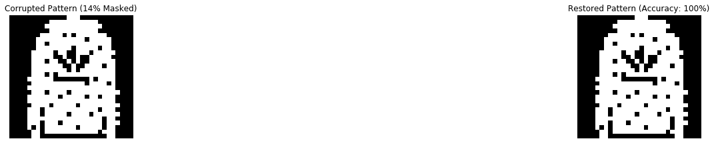

# A Brief Walkthrough of Hopfield Networks

### Introduction

Hopfield Networks are a type of recurrent neural network (RNN) under the topic of unsupervised learning. It was first described in detail by Hopfield in his 1982 paper <a href = "https://www.pnas.org/doi/10.1073/pnas.79.8.2554">"Neural networks and physical systems with emergent collective computational abilities"</a>. Hopfield Networks provided us with a model on how human memory is able to store information, which served its use in both biology and computer science.

We aim uncover the mathematics behind Hopfield Networks, and present a working set of codes that can be found in this <a href = "https://github.com/DenseLance/hopfield-networks">Github repository</a>.

#### Required libraries

- <a href = "https://pypi.org/project/numpy/">numpy</a>
- <a href = "https://pypi.org/project/matplotlib/">matplotlib</a>
- <a href = "https://pypi.org/project/Pillow/">PIL</a>
- <a href = "https://pypi.org/project/pandas/">pandas</a> (for Modified Hopfield Networks)
- <a href = "https://pypi.org/project/tqdm/">tqdm</a> (for Modified Hopfield Networks)

### Classical Hopfield Networks

In this section, we will focus on the main use of Hopfield Networks — image restoration. Solving optimization problems is another major application of Hopfield network. In our case, we train the Hopfield Network by feeding it with correct images (ground truth) and attempt to recover said images from the network by using only corrupted versions of them as input.

#### Image processing

The image used for both training and testing has to be processed for it to be a valid input of a Hopfield Network. To convert the image to state $\boldsymbol{x}$ that the model understands, the image has to be bilevel (binary). In our case, we would use polar values for the image where $\boldsymbol{x} \in \\{-1,1\\}^d$ instead of binary values, noting that $\boldsymbol{d} = width \cdot height$. Next, the image is transformed to an array-like structure and flattened to become 1-dimensional. The following code shows how this is done in Python, assuming `type(image) = PIL.Image`.

```python
states = np.asarray(image.convert("1"))  # converting to black and white image
states = states * 2 - 1 # converting image to polar values of {-1, 1}
states = states.flatten() # converting image to a singular axis
```

#### Training

Training of the Hopfield Network follows the Hebbian learning rule. The weights of the network $\boldsymbol{W}$ are determined to be $\boldsymbol{W} = \boldsymbol{x} \otimes \boldsymbol{x}^T - \boldsymbol{I}$, where $\boldsymbol{I}$ is the identity vector.

Cross product of the state and its transposed vector is used, as the weights of edges between two nodes in the Hopfield Network are symmetric, in which $\boldsymbol{W}\_{ij} = \boldsymbol{W}\_{ji}$. Another important point to note is that nodes do not have an edge directed to themselves, therefore $\boldsymbol{W}\_{ii} = 0$. Since identity matrix has ones on the main diagonal and zeros for the other values, and considering that $\boldsymbol{x}\_{i} \cdot \boldsymbol{x}\_{i}$ is always equals to 1, $\boldsymbol{W}\_{ii} = \boldsymbol{x}\_{i} \cdot \boldsymbol{x}\_{i} - \boldsymbol{I}\_{ii} = 0$ can be achieved for all values of $\boldsymbol{i}$.

Training can be done simply as such:

```python
weights = np.outer(states, states.T)
np.fill_diagonal(weights, 0)
previous_weights += weights
```

`np.fill_diagonal()` is a really handy and efficient tool in zeroing out the diagonal of our weight matrix instead of subtracting the identity matrix from it. From the Hebbian learning rule, we note that old weights should not be forgotten when a new set of weights is learned. As such, we add both the old and new weights together to obtain our updated weights. This method of updating weights also means that similar patterns are likely to be jumbled up when trying to retrieve them later.

#### Recovering the image

There are two ways in which we can recover the states from Classical Hopfield Networks: synchronous and asynchronous.

For the synchronous update rule, it is more straightforward as all values in the state matrix are recovered at the same time. By allowing $\boldsymbol{\theta}$ to be the list of threshold values and $\boldsymbol{x^\prime}$ to be the corrupted image we input into the network, we can recover our image (state) $\hat{\boldsymbol{x}}$ as:

```math
\begin{align} sgn(\hat{\boldsymbol{x_i}}) = \begin{cases} +1 \qquad if \quad \sum\limits_{j = 1}^{d}(\boldsymbol{W}_{ij} \cdot \boldsymbol{x^\prime}j) \ge \boldsymbol{\theta}i \newline -1 \qquad if \quad \sum\limits_{j = 1}^{d}(\boldsymbol{W}{ij} \cdot \boldsymbol{x^\prime}_j) < \boldsymbol{\theta}_i \end{cases} \end{align}
```

Codewise it would look like this, where we note that the values of our states should be converted back to polar:

```python
predicted_states = (np.matmul(weights, states) >= threshold) * 2 - 1
```

On the other hand, the asynchronous update rule would take a longer time to converge, as it attempts to recover values in the state matrix one at a time and at random. While it is less efficient, it is often more accurate when retrieving stored information from the Hopfield Network than its synchronous counterpart. Using the above formula from the synchronous update rule, our code can be translated to be as such:

```python
predicted_states = states.copy()
for _ in range(number_of_iterations):
    index = np.random.randint(0, len(weights))
    predicted_states[index] = (np.matmul(weights[index], predicted_states) >= threshold[index]) * 2 - 1
```

#### Example using synchronous update rule

This section can be found in the <i>Classical Hopfield Network.ipynb</i> file.

To give an example, we use the 5 images below from the MNIST fashion dataset to train our Hopfield Network.

<p align = "center"></p>

We then attempt to restore all images by retrieving it from the Hopfield Network, using the uncorrupted original images as input. In this particular set of data, we managed to restore all of the images with 100% accuracy using the synchronous update rule, which meant that the network was still able to distinguish between the 5 images.

<p align = "center"></p>

<p align = "center"></p>

<p align = "center"></p>

<p align = "center"></p>

<p align = "center"></p>

However, what happens if we corrupt the images by masking them? As seen below, the accuracy of the restored image gets worse as we corrupt it further.

<p align = "center"></p>

<p align = "center"></p>

<p align = "center"></p>

<p align = "center"></p>

<p align = "center"></p>

<p align = "center"></p>

<p align = "center"></p>

#### Storage capacity

Imperfect retrieval of images could be due to nearing or exceeding storage capacity. To ensure that retrieval of patterns is free of patterns, number of images trained by the Hopfield Network should not be above the storage capacity of:

$$C \cong \frac{d}{2\log(d)}$$

On the other hand, for the retrieval of patterns with a small percentage of errors, the storage capacity can be said to be:

$$C \cong 0.14 d$$

If the number of patterns stored is a lot lower than the storage capacity, then the error does not lie with the lack of storage capacity. Instead, it is highly likely caused by images in the training dataset being strongly correlated to each other. In this regard, Modern Hopfield Networks are better.

### Future Work

- [ ] Code for Modern Hopfield Networks (aka Dense Associative Memories), as described <a href = "https://arxiv.org/abs/1606.01164">here</a>, <a  href = "https://arxiv.org/abs/1702.01929">here</a> and <a href = "https://arxiv.org/abs/2008.02217">here</a>.
- [x] Solving the Travelling Salesman Problem (or other NP-hard problems) using Hopfield Networks.